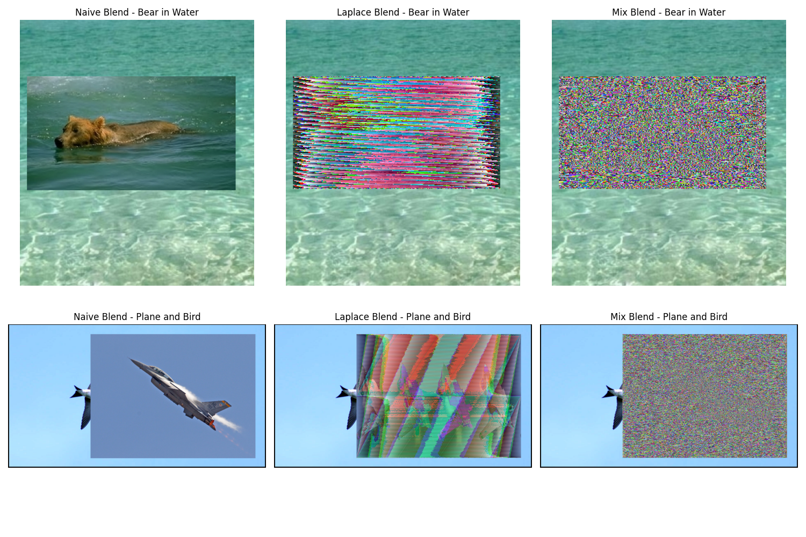

# Image Blending

## Blended Images

<p align="center">
    
</p>

## Laplace Operator

The `laplace_operator` method will give us the following
array for the input `5, 7`.

```
[[-4.  2.  0. ...  0.  0.  0.]
 [ 2. -4.  2. ...  0.  0.  0.]
 [ 0.  2. -4. ...  0.  0.  0.]
 ...
 [ 0.  0.  0. ... -4.  2.  0.]
 [ 0.  0.  0. ...  2. -4.  2.]
 [ 0.  0.  0. ...  0.  2. -4.]]
```

The shape of this array is `(5 * 7, 5 * 7) = (35, 35)`.

## What Went Wrong

As you can see, the blending is clearly not working
(neither the laplace blend, nor the mix blend).
I suspect there to be some issues with the indices,
but I could not for the life of me figure out the exact issue.
One thing that really tripped me is the fact that mathematicians
use column-major ordering to represent matrices while
software engineers use row-major ordering.
As I am not a mathematician, this led to many hours of confusion.

It's also somewhat visible in the laplace blend in the plane-bird
image. The pixels seems shifted in row/column which suggests that there
is some bug with that indices.

The grayscale of the images didn't reveal any insight regarding this bug either.
